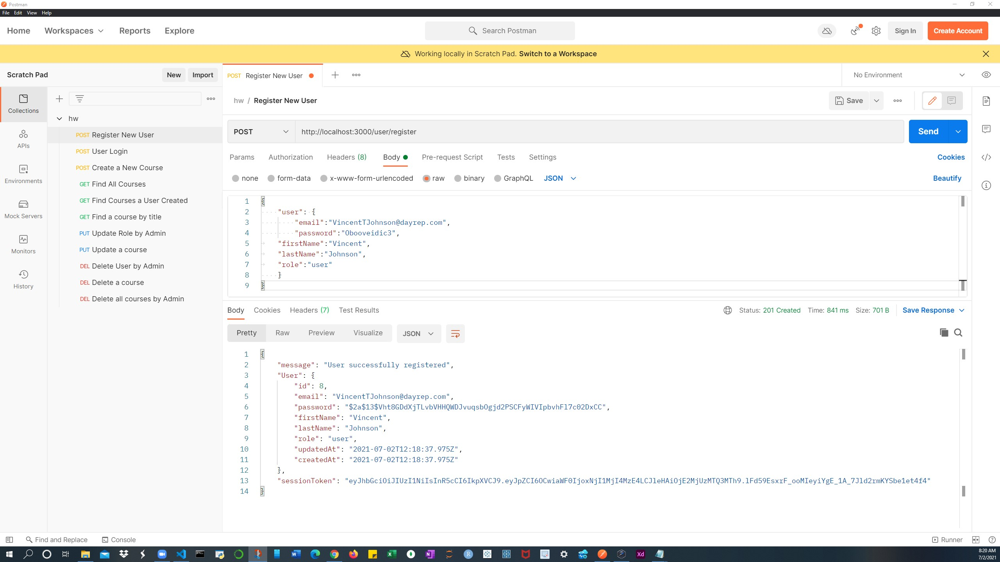

# redBadgeServer

Server for an elearning app. Buitl with Node.js and express it was sucessfully depoyed to heroku [here](https://kplanuapp.herokuapp.com/).

# Endpoints

### Register New User: POST - http://localhost:#port/user/register

### User Login: POST - http://localhost:3000/user/login

### Create New Course: POST - http://localhost:3000/course/create

### Enroll Student: POST - http://localhost:3000/enroll/new/

### Find A Course by Title: GET - http://localhost:3000/course/Biotechnology

### Update an User Role PUT - http://localhost:3000/user/admin/update/8

### Delete a course by ID Delete - http://localhost:3000/user/admin/update/8

